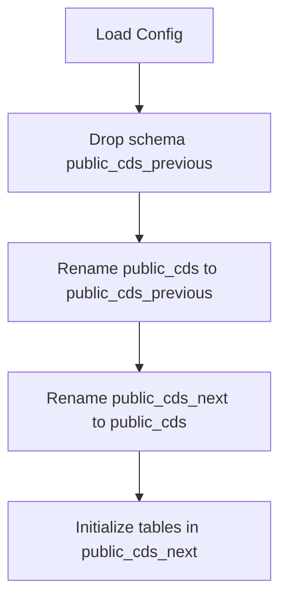

# API DB Rollover

This code is used to replace the live data in `public_cds` with <b>validated</b>
data in `public_cds_next`. To do this it:

1. Drops `public_cds_previous` schema and subsequent tables.
2. Renames the current `public_cds` schema to `public_cds_previous`, so
   there is 1 backup.
3. Renames `public_cds_next` to `public_cds`.
4. Grants permissions to `public_cds` to the "cds-api" user.
5. Creates the `public_cds_next` schema and tables.
6. Commits these changes once, so if any of the above fail, all changes are rolled back.

---

## Core Structure

```text
.
├── main.py                 # Entry point – orchestrates the full workflow
├── update_public_cds.py    # Core API rollover processing logic
└── config.yaml             # Runtime configuration
```

## High-level Workflow



## Parameters

Runtime parameters are specified in `config.yaml`. The only required parameter is
the name of the Postgres Database (unlikely to change).

See the [default config file](./src/api_db_rollover/config.yaml) for details.

## Usage

From the project root, run:

```bash
uv run packages/api-db-rollover/src/api_db_rollover/main.py
```

<b>This should only be run once the new data is uploaded to `public_cds_next`
and is validated.</b> This code does not complete any validation on the new data
before moving it to `public_cds`.
