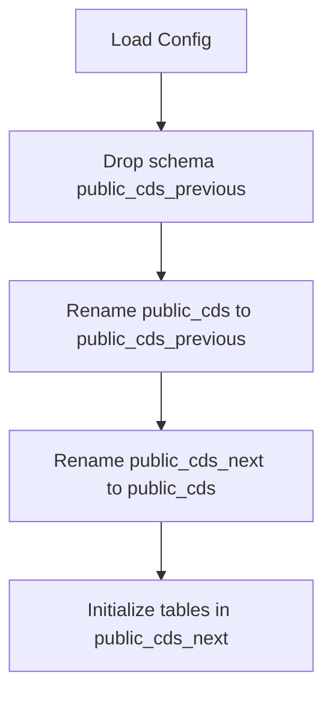

# API DB Rollover

This code is used to replace the live data in `public_cds` with <b>validated</b>
data in `public_cds_next`. To do this it:
1. Drops `public_cds_previous` schema and subsequent tables.
2. Renames the current `public_cds` schema to `public_cds_previous`, so
there is 1 backup.
3. Renames `public_cds_next` to `public_cds`.
4. Grants permissions to `public_cds` to the "cds-api" user.
5. Creates the `public_cds_next` schema and tables.
6. Commits these changes once, so if any of the above fail, all changes are rolled back.

---

## Setup

Clone the repository and install dependencies:

```bash
cd smart-prototype/packages/sign-loader
uv sync
```

This will:
* Create a virtual environment
* Install all dependencies defined in `pyproject.toml`
* Install the `curb-utils` workspace package

---
### Environment Variables (`.env`)
The entry point of this process (`main.py`) loads environment variables using `python-dotenv`:
```python
from dotenv import load_dotenv
load_dotenv()
```
Create a local `.env` file (not committed) for database connection settings used by your `smart_curb_db` layer 
(exact variables depend on your implementation).
Use this template:
```text
DB_HOST=localhost
DB_PORT=5432
DB_USER=your_username
DB_PASSWORD=your_password
```
---

## Core Structure
```text
.
├── main.py                 # Entry point – orchestrates the full workflow
├── update_public_cds.py    # Core API rollover processing logic
└── config.yaml             # Runtime configuration
```

## High-level Workflow



## Parameters
Parameters are specified in `config.yaml`. These are configurable but unlikely
to change unless there's a database migration.

| Parameter         | Description                                                          |
|-------------------|----------------------------------------------------------------------|
| `database`        | Name of database to connect to                                       |
| `schema`          | Name of schema -- required by SmartDB connection but not really used |

## Usage 

To run:

```bash 
uv run packages/api-db-rollover/src/api_db_rollover/main.py
```

<b>This should only be run once the new data is uploaded to `public_cds_next`
and is validated.</b> This code does not complete any validation on the new data
before moving it to `public_cds`.