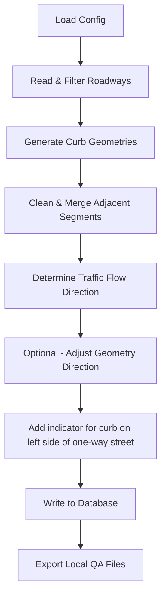

# Curb Blockface Generation Pipeline

A Python toolkit for generating curb blockface geometries from the [MassDOT Roadway Inventory Dataset](https://geo-massdot.opendata.arcgis.com/datasets/MassDOT::road-inventory-2024/explore).
The data dictionary can be found [here](https://www.mass.gov/doc/road-inventory-data-dictionary/download).

## Overview

This toolkit automates the generation of curb lines (also known as blockfaces) from the street centerline geometries.
It reads roadway inventory data, applies configurable filters, computes curb offsets,
cleans and merges geometries, determines the traffic flow direction, and exports results to:

- A PostgreSQL/PostGIS database (for production use), and/or
- Local files (GeoJSON or Parquet) for QA, visualization, and mapping.

The pipeline is configuration-driven, reproducible, and designed to run sequentially from a single entry point.

## Core Structure

```text
.
├── main.py                 # Entry point – orchestrates the full workflow
├── curb_generation.py      # Core curb generation and geometry processing logic
├── config.yaml             # Runtime configuration
├── inputs/                 # Input roadway dataset
├── outputs/                # Local QA and mapping outputs
└── logs/                   # Log files
```

## High-level Workflow



Each step is modular, testable, and parameterized through `config.yaml`.

## Usage

From the project root (`smart-prototype/`), run:

```sh
uv run python -m blockface_creator
```

## Configuration (`config.yaml`)

All runtime behavior is controlled through a YAML configuration file.  
See the [default config file](./src/blockface_creator/config.yaml) for details.


## Core Processing Module (`curb_generation.py`)

This script has all the core functional components to run the pipeline.

## Step-by-Step Breakdown

### 1. Load Configuration

- Reads `config.yaml` via `yaml.safe_load`.
- Controls runtime behavior (filters, CRS, output type, database targets, debug mode).
- `debug_mode=True` prevents any DB writes, but still generates local outputs.

### 2. Read and Filter Roadways (`read_roadways()`)

Supported formats: Parquet, Feather, GeoJSON, Shapefile.

Filtering logic:

- Start with `mask = True` for all rows
- Apply `include_filters` as **must-match**
- Apply `exclude_filters` as **must-not-match**

This allows a single run to target a subset of the network
(e.g., a city, functional class exclusions, system exclusions).

### 3. Create Curbs (`create_curbs()`)

#### 3.1 CRS normalization for measurements

Temporarily projects roadway geometries to `ft_crs` (US survey feet) for buffer widths, offset distances, and
segment lengths.

#### 3.2 Buffer derivation (MassDOT-style attributes)

`buffer_l` and `buffer_r` are computed from roadway attributes such as `Surface_Wd`, `ROW_Width`, `Lt_Sidewlk`,
`Rt_Sidewlk`, `Shldr_Lt_W`, `Shldr_Rt_W`.
These buffers represent curb offsets from the roadway centerline.

#### 3.3 Offset generation (`offset_lines()`)

- For each line, generates a left offset line (if `buffer_l > 0`) and a right offset line (if `buffer_r > 0`)
- Handles `LineString` and `MultiLineString`
- Uses `parallel_offset(..., join_style=2)` for sharper corners

#### 3.4 Cleanup via overlay buffers

- Creates “removal buffers” on both sides (subtracting `ft_diff`)
- Uses `gpd.overlay(..., how="symmetric_difference")` to remove overlapping/invalid curb parts
- Explodes multipart geometries into single features

#### 3.5 Cleanup via overlay buffers

- Adds `start_lon`, `start_lat`, `end_lon`, `end_lat`, `curb_length_ft` for each curb line
- Removes segments shorter than `min_seg_len`.

### 4. Merge Adjacent Segments (`merge_adjacent_lines()`)

This process converts fragmented curb pieces into continuous curb blockfaces.
This step reduces fragmentation and improves downstream usability.

#### Steps:

- Buffer start points and end points by `max_dist`
- Spatial join to find candidate adjacency pairs
- Restrict candidates to those matching `dissolve_cols` (e.g., same route/side)
- Chain segments and build merged `LineString` geometries

### 5. Determine Traffic Flow and Adjust Geometry

#### 5.1 Direction of flow (`determine_direction_of_flow()`)

- Uses roadway metadata:
  - `operation` (e.g., one-way vs. two-way)
  - `oneway` digitization indicator (`FT` or `TF`)
  - curb `side` (`left` or `right`)
- Outputs one of `forward`, `reverse` or `None` (if it cannot determine)

#### 5.2 Geometry adjustment (`apply_flow_direction()`)

If `adjust_geometry=True`:

- Reverses the coordinate order of geometries which are in the `reverse` direction of traffic flow.
- Then standardizes the flag by setting all to `forward`.

This ensures a consistent geometry direction for downstream matching and linear referencing in the direction of
traffic flow.

#### 5.3 Left-side one-way flag (`add_is_left_side_oneway()`)

- Adds `is_left_side_oneway` when the curb is on the left side of a one-way street relative to the direction of travel.
- Based on `operation`, `oneway`, and `side` metadata.

### 6. Postgres Export (`write_blockfaces_to_db()`)

- Creates a new job record (metadata) in the `blockface_jobs` table
- Append blockface geometries in the `curb_blockfaces` (geometry column labeled as `geography`) table with the current
  `job_id`
- Writes `job_timestamp` in `blockface_jobs` and `is_left_side_oneway` in `curb_blockfaces`

It generates a UUID (`job_id`) for each run.
If `debug_mode=True` in `config.yaml`, it skips `append_data` calls but still returns outputs for QA, validation,
parameter testing, investigating edge cases, and general tests.

### 7. Local QA Export (`write_gdf_to_file()`)

- Exports a GeoDataFrame to GeoJSON or Parquet, depending on the specification in `config.yaml`.
- Projects to `output_crs`, writes to `output_path` and embeds `job_id` and `timestamp` in filename.

## Data Dictionary

### PostGIS Table: `blockface_jobs`

| Column            | Type      | Description                              |
| ----------------- | --------- | ---------------------------------------- |
| `job_id`          | UUID      | Unique identifier for a processing run   |
| `job_name`        | text      | Human-readable name (timestamp-prefixed) |
| `job_description` | text      | Description (timestamp-prefixed)         |
| `job_timestamp`   | timestamp | Timestamp for the processing run         |

### PostGIS Table: `curb_blockfaces`

| Column                | Type               | Description                                      |
| --------------------- | ------------------ | ------------------------------------------------ |
| `blockface_id`        | UUID               | Unique identifier per curb blockface             |
| `job_id`              | UUID               | Foreign key reference to `blockface_jobs.job_id` |
| `geography`           | geometry/geography | Blockface geometry (LineString)                  |
| `is_left_side_oneway` | boolean            | True if curb is left-side on a one-way segment   |

Internally, the pipeline uses a `mapping_dict` keyed by `curb_id` to attach DB UUIDs and the `is_left_side_oneway` flag
back to a local QA GeoDataFrame for consistency.

### Local QA Output Schema (GeoJSON/Parquet)

These fields will be present in the locally exported file (post-processing and with UUIDs attached):

| Column                   | Type       | Description                                              |
| ------------------------ | ---------- | -------------------------------------------------------- |
| `curb_id`                | int        | Internal curb identifier                                 |
| `roadway_id`             | int        | Source roadway feature identifier                        |
| `street_name`            | text       | Street name from roadway inventory                       |
| `route_id`               | text       | Route identifier                                         |
| `route_direction`        | text       | Route direction value                                    |
| `ff_class`               | int        | Functional class                                         |
| `side`                   | text       | `left` or `right`                                        |
| `buffer_left`            | int        | Left offset distance (feet)                              |
| `buffer_right`           | int        | Right offset distance (feet)                             |
| `operation`              | int        | Roadway operation flag (e.g., one-way/two-way)           |
| `oneway`                 | text       | Digitization direction indicator (`FT`/`TF`)             |
| `direction_of_flow`      | text       | Flow direction (standardized to `forward` when adjusted) |
| `is_left_side_oneway`    | boolean    | True if curb is left-side on a one-way segment           |
| `blockface_id`           | UUID       | Assigned blockface UUID                                  |
| `job_id`                 | UUID       | Run UUID                                                 |
| `geometry`               | LineString | Blockface geometry                                       |
| `start_lon`, `start_lat` | float      | Start coordinate                                         |
| `end_lon`, `end_lat`     | float      | End coordinate                                           |
| `curb_length_ft`         | float      | Length in feet                                           |

## More Documentation

Detailed technical discussions are separated for clarity:

- Known Limitations and Edge Cases:
  👉 [docs/known-limitations.md](./docs/known-limitations.md)
- Direction of Flow Specification:
  👉 [docs/direction-of-flow.md](./docs/direction-of-flow.md)
