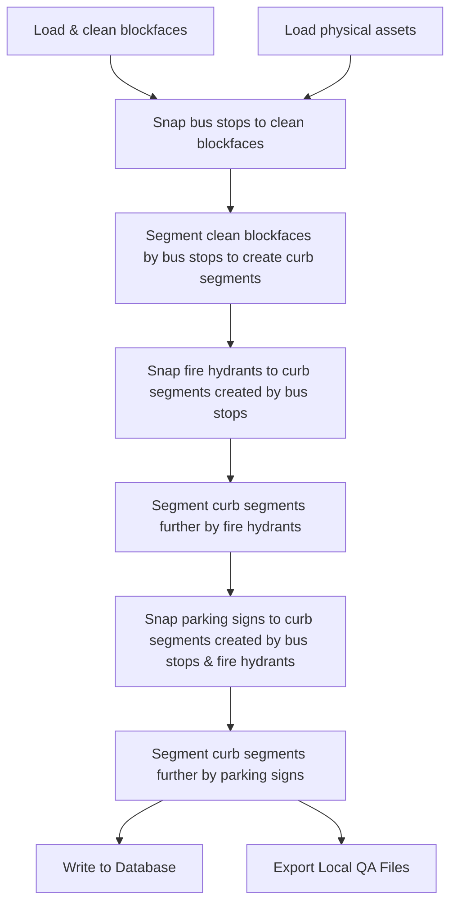

# Curb Segmentation Pipeline

A Python toolkit to pull standardized physical asset data and divide curb blockfaces, as generated through the [Curb Blockface Generation Pipeline](https://github.com/OETBoston/smart-curb-geometry-creation/blob/postgres-export/README.md), into segments.

## Overview

This toolkit automates the generation of curb segments from curb blockfaces and physical assets.
It reads in blockface geometries and physical asset data from bus stops, fire hydrants, and parking signs.
It then uses the physical asset data to segment the blockfaces and exports the results to:

- A PostgreSQL/PostGIS database (for production use), and/or
- Local files (GeoJSON or Parquet) for QA, visualization, and mapping.

The pipeline is configuration-driven, reproducible, and designed to run sequentially from a single entry point.

## Table of Contents

- [Installation](#installation)
  - [Create and Sync Python Environment](#create-and-sync-python-environment)
  - [Environment Variables](#environment-variables-env)
- [Core Structure](#core-structure)
- [Segmentation Process](#segmentation-process)
  - [Sources of Physical Assets](#sources-of-physical-assets)
  - [High-level Workflow](#high-level-workflow)
  - [Additional Details on Segmentation Process](#additional-details-on-segmentation-process)
- [Configuration](#configuration-configyaml)
- [Outputs](#outputs)
  - [PostGIS Table: `curb_segment_jobs`](#postgis-table-curb_segment_jobs)
  - [PostGIS Table: `curb_segments`](#postgis-table-curb_segments)

## Core Structure

```text
.
├── main.py                 # Entry point – orchestrates the full workflow
├── curb_segmentation.py    # Core curb segmentation and processing logic
├── io_utils.py             # Utility functions for input/output operations
├── config.yaml             # Runtime configuration
├── outputs/                # Local QA and mapping outputs
└── logs/                   # Log files
```

## Segmentation Process

Curbs are segmented in the following order:

1. Bus stops
2. Fire hydrants
3. Parking signs
4. Parking meters

Bus stops and fire hydrants define a segment, i.e., a segment is made up of the buffer zone around a bus stop or a fire hydrant.
This is in contrast to parking signs which are used as the start/end points of a segment.

### Sources of Physical Assets

- Bus stops: Bus stops information is pulled from `stops.txt` from [MBTA's GTFS feed](https://www.mbta.com/developers/gtfs).
- Fire hydrants: The fire hydrants data comes from the City of Boston's open data portal, [Analyze Boston](https://data.boston.gov/dataset/fire-hydrants).
- Parking signs: Parking signs data comes from the [Cartegraph dataset](https://data.boston.gov/dataset/signs-cartegraph)
  on the City of Boston's open data portal, Analyze Boston.
- Parking meters: Internal data from the City of Boston Parking Clerk (pre-processed to 
include a start and end point for each parking zone)

These datasets were externally processed, transformed, and loaded into PostgreSQL database tables for downstream use.

### High-Level Workflow



### Additional Details on Segmentation Process

- **Snapping assets to curb**: Each physical asset is "snapped" to the curb lines.
  An asset that might be located near the curb line according to its latitude and longitude is placed directly on the curb line to segment it. This "snapping" also records how far into the curb segment the stop is located, i.e., if a curb is 100 feet and a bus stop is snapped to a position that is 25 feet from the start of the segment; then this fraction is 0.25 (`25/100`).
- **Bus stop segments**: The curb fraction described above is used to classify the type of each bus stop into `near_side`, `far_side`, and `mid_block` stops. The ranges for these classifications are in the `stop_types` field in `config.yaml`. One endpoint of the segment is assumed to be the snapped point of the bus stop to the curb. The average bus stop length of 75 feet in this segmentation process to find the second endpoint. This distance is added or subtracted from the original bus stop point depending on the bus stop type, which is specified in the `buffer_multiplier` fields for each stop type in `config.yaml`. If a bus stop's +/- 75-feet buffer extends longer than the end of the curb that is being segmented, the endpoint of the new segment is truncated to the end of the curb segment.
  - <i>Example: if a curb that is being segmented is 100 feet long and a GTFS bus stop is snapped to 50 feet into the segment, the second endpoint will be 0 feet into the segment instead of -25 feet.</i>
- **Fire hydrant segments**: Each fire hydrant is assumed to have a required buffer distance on each side of the fire hydrant, e.g., there is no parking allowed for 10 feet on either side of the fire hydrant. This `buffer_distance_ft` can be updated in the `config.yaml`. The length of these curb segments is therefore 20 feet with the fire hydrant point in the center. In some cases, the length can be shorter than 20 feet if the curb segment itself is shorter than 20 feet. In other words, if a fire hydrant's +/- 20-feet buffer extends beyond the length of the curb segment that is being segmented, the buffer boundary that extends beyond the entext of the curb segment (upstream, downstream, or both) is truncated to the end of the curb segment. This approach is similar to that used in the segmentation by bus stop. If the buffers of two or more fire hydrants overlap, they are grouped into one unified segment.

## Usage

From the project root (`smart-prototype/`), run:

```sh
uv run python -m curb_segmenter
```

## Configuration (`config.yaml`)

All runtime behavior is controlled through a YAML configuration file.  
See the [default config file](./src/curb_segmenter/config.yaml) for details.

## Outputs

### PostGIS Table: `curb_segment_jobs`

| Name              | Type      | Description                              |
| ----------------- | --------- | ---------------------------------------- |
| `job_id`          | UUID      | Unique identifier per a processing run   |
| `job_timestamp`   | TIMESTAMP | Time job was run                         |
| `job_name`        | VARCHAR   | Human-readable, short description of job |
| `job_description` | VARCHAR   | Longer description of job                |

### PostGIS Table: `curb_segments`

| Name                  | Type                 | Description                                                                                                                                                                          |
| :-------------------- | :------------------- | :----------------------------------------------------------------------------------------------------------------------------------------------------------------------------------- |
| `segment_id`          | UUID                 | Unique identifier per each curb segment                                                                                                                                              |
| `blockface_id`        | UUID                 | Foreign key reference to `curb_blockfaces.blockface_id`                                                                                                                              |
| `job_id`              | UUID                 | Foreign key reference to `curb_segment_jobs.job_id`                                                                                                                                  |
| `segment_seq`         | INTEGER              | Sequential value starting at zero, ordered in the direction of traffic flow                                                                                                          |
| `is_left_side_oneway` | BOOLEAN              | Indicates that the curb segment is on the left side of a one way street. Carried forward from the `curb_blockfaces` table.                                                           |
| `geography`           | GEOMETRY(LineString) | Geometry of curb segment                                                                                                                                                             |
| `upstream_location`   | UUID                 | Foreign key references to `asset_locations.asset_location_id`                                                                                                                        |
| `downstream_location` | UUID                 | Foreign key references to `asset_locations.asset_location_id`                                                                                                                        |
| `upstream_loc_list`   | ARRAY (UUID)         | List of upstream locations, contains multiple locations only if multiple assets were snapped to the same location. Null if there are not any assets at the beginning of the segment. |
| `downstream_loc_list` | ARRAY (UUID)         | List of downstream locations, contains multiple locations only if multiple assets were snapped to the same location. Null if there are not any assets at the end of the segment.     |
